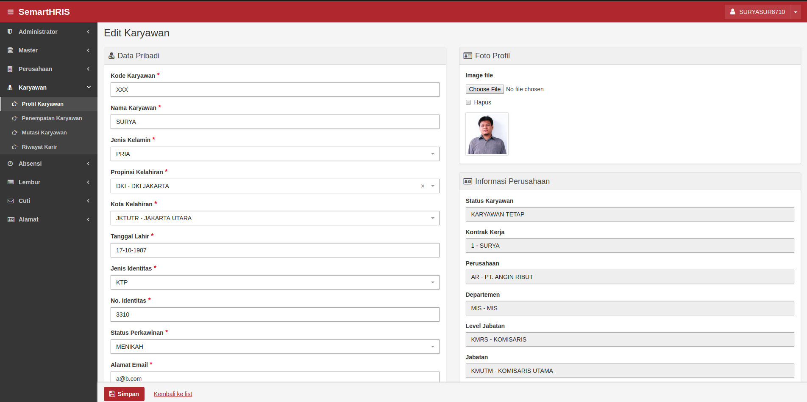
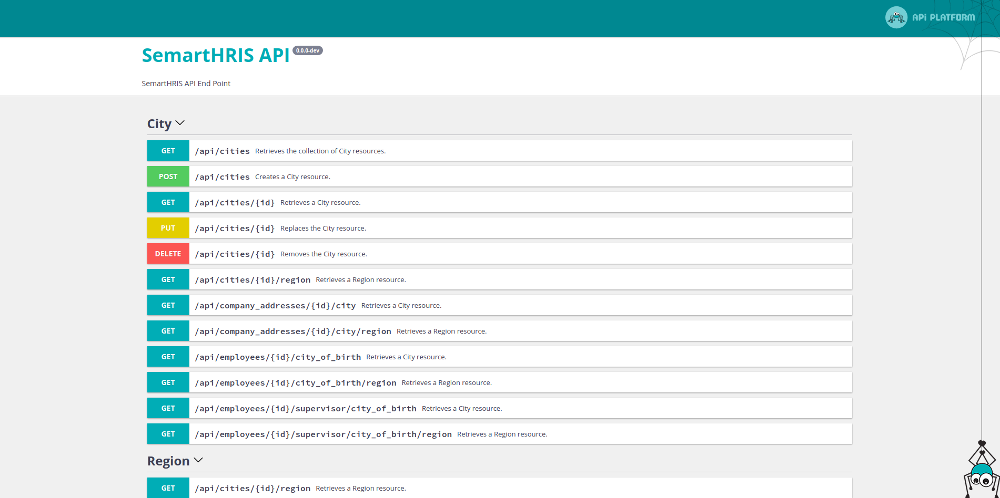

# SemartHris

SemartHris adalah Human Resources Information System (HRIS) yang dapat digunakan untuk membantu memudahkan tugas HRD Perusahaan.

## Tahap Pengembangan

SemartHris belum dapat digunakan untuk produksi dan sedang dalam proses pengembangan.

## Fitur

- [X] Menejemen Perusahaan
- [X] Suport Multi Perusahaan
- [X] Menejemen Jabatan
- [X] Menejemen Shift Kerja
- [X] Menejemen Karyawan
- [X] Support Multi Alamat
- [X] Support Penempatan Karyawan
- [X] Menejemen Kontrak Kerja
- [X] Menejemen Kontrak Perusahaan dengan Rekanan/Klien
- [X] Backend Site and API Sekaligus

## TODO LIST

- [X] Master Alasan Ketidakhadiran dan Cuti
- [X] Master Gelar Pendidikan dan Instansi Pendidikan
- [X] Master Propinsi dan Kota
- [X] Master Keahlian dan Group Keahlian
- [X] Master Perusahaan dan Department
- [X] Master Alamat Perusahaan
- [X] Remove Default From Address When Default Address is Submitted
- [X] Set Random Default When Default Address is Deleted
- [X] Repository yang dibutuhkan untuk Karyawan
- [X] Data Transformer untuk Karyawan
- [X] Improvisasi Form Karyawan
- [X] Form Manipulator untuk Karyawan
- [X] Perancangan Form Edit Karyawan
- [X] Refactor Menu
- [X] Master Jabatan dan Level Jabatan
- [X] Master Shift Kerja
- [X] Create Username Generator Service
- [X] Implement User Model and Repository
- [X] Add Listener to Generate Username, Role and Applying Default Password
- [X] Improvement Company Address
- [X] Improvement Company Employee
- [X] Contract Management
- [ ] Create Job Allocation When Creating New Employee
- [ ] Soft Delete and Blameable
- [ ] Change Password
- [ ] Change Role
- [ ] Menejemen Absensi
- [ ] Login Page
- [ ] Delete Session Notification

