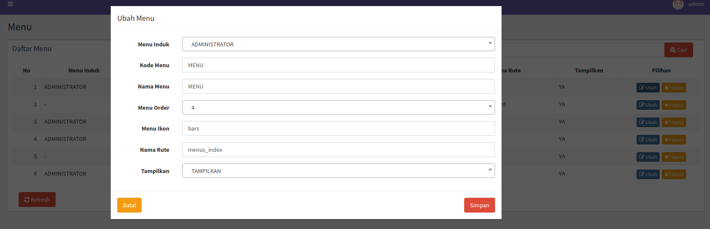

# Menu

## Mengatur Menu

Untuk mengatur menu sangatlah mudah, Anda cukup masuk ke menu **Administrator > Menu** lalu dapat menambah, mengedit maupun menghapus menu sesuai kebutuhan.

## Fungsi Masing-Masing Atribut

Pada gambar di atas, terlihat ada beberapa atribut atau field pada form **Menu** yang memiliki fungsi sebagai berikut:

- **Menu Induk**: Bila tidak memiliki induk, maka menu tersebut akan menjadi root menu.

- **Kode Menu**: Nilai ini harus unik dan digunakan sebagai parameter para pengaturan hak akses.

- **Nama Menu**: Teks yang akan muncul pada menu bar.

- **Menu Order**: Urutan menu pada menu bar.

- **Menu Ikon**: Nilai ini adalah ikon yang akan digunakan pada menu, saya menggunakan font awesome dan meninggalkan prefix `fa-` sehingga bila Anda mengisi `bars`, itu artinya nilai tersebut akan dijadikan `fa-bars`.

- **Menu Rute**: Route controller.

- **Tampilkan**: Ditampilkan atau tidak menu tersebut.

[Kembali Ke Index](README.md)
